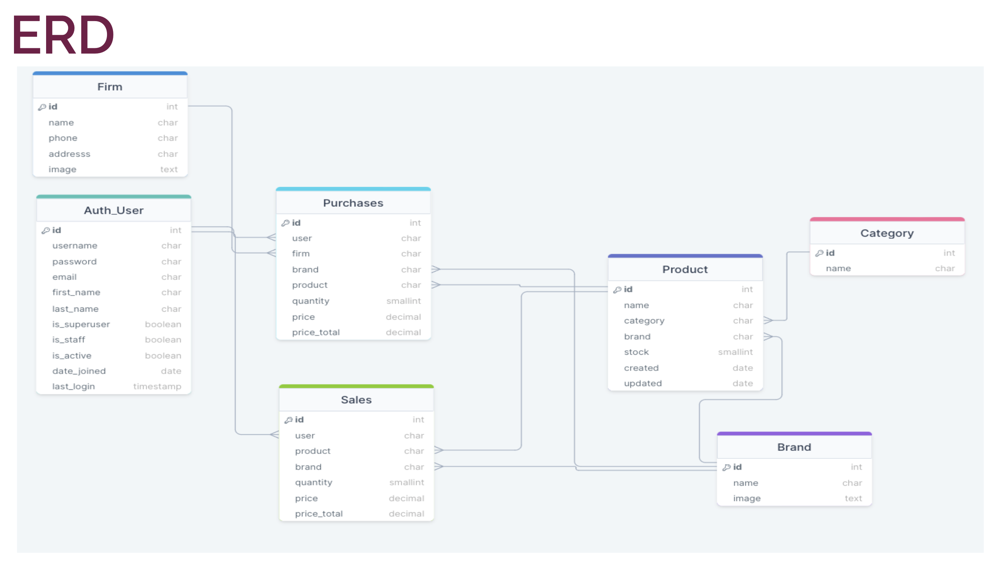

# Stock Management API with Django Rest Framework

- Allows user Register/login/logout
- CRUD operations for Product,Purchases,Sales,Firm,Brand and Category according to user's roles

## User Roles

#### Manager:

- Authorized all CRUD operations in Stock App

#### Product Manager:

- Authorized all CRUD operations in Category,Brand,Firm,Product tables

#### Finance:

- Authorized all CRUD operations in Purchases & Sales tables and read only other tables

#### Read Only:

- Authorized only read operations in all tables

## Information

- price_total field,which in stock table,is read_only field and this value is calculated with quantity and price fields.
- filter and search features to all views is done

## Technology Stack

**Backend:** Python, Django

**Databases:** SQLite

**Deploy:** pythonanywhere

**Testing:** Postman
